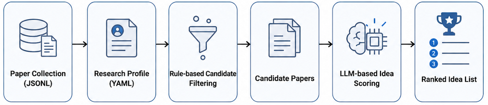

<div align="center">

# 🧭 IdeaScout

### Find transferable research ideas from other fields

<p>
  
  
  
  
</p>

**IdeaScout helps researchers discover ideas from other fields that may transfer to their own research problems.**

</div>

---

## ✨ What is IdeaScout?

**IdeaScout is a profile-guided toolkit for cross-domain research idea discovery.**

Most paper search tools help you find papers that are already close to your topic.  
IdeaScout is designed for a different use case:

> **Find methods, mechanisms, and ideas from other fields that can be adapted to your own task.**

For example, a computer vision paper may contain a representation editing idea useful for speech.  
A robotics paper may contain a temporal modeling idea useful for audio or video.  
A multimodal learning paper may contain an alignment mechanism useful for another domain.

You define your own **research profile**, including your target task, preferred mechanisms, negative filters, and scoring criteria. IdeaScout then filters a large paper collection, asks an LLM to infer each paper's core idea, and ranks papers by how likely their ideas are to transfer to your research direction.

IdeaScout is not a replacement for reading papers.  
It is a tool for reducing the search space and finding promising cross-domain inspiration.

---

## 🔁 From Other Fields to Your Field

IdeaScout is not meant to answer only:

> Is this paper related to my topic?

Instead, it asks:

> Can this paper's core idea be transferred to my research problem?

This makes it useful for early-stage research ideation. You can use it to mine ideas from fields such as:

- computer vision;
- natural language processing;
- multimodal learning;
- generative modeling;
- robotics;
- medical imaging;
- speech processing;
- representation learning.

The output is not just a list of similar papers.  
It is a ranked list of papers whose **ideas may be reusable in your own domain**.

---

## 🎯 Why IdeaScout?

When doing research, we often do not only need papers that are about the same task.

We also want to know:

- Can a method from another field inspire my own work?
- Can a mechanism from CV, NLP, multimodal learning, or generative modeling be adapted to my problem?
- Which papers are worth reading because their ideas are transferable, even if their topics are different?

IdeaScout is built for this type of exploration.

It helps you:

- 🔍 search for **transferable ideas**, not only related papers;
- 🧠 discover useful mechanisms from **other research fields**;
- ⚙️ define your own research profile and scoring criteria;
- 📊 rank papers by transferability, novelty, and feasibility;
- 🔁 run large LLM-based scoring jobs with resume and auto-retry;
- 🌐 browse scored papers through a lightweight web portal.

---

## 🏗️ Pipeline Overview

<div align="center">
  
  <br>
  <em>Overview of the IdeaScout pipeline.</em>
</div>

IdeaScout separates idea discovery into two stages:

1. **Rule-based candidate filtering**  
   A fast stage that selects candidate papers using profile keywords, preferred mechanisms, and negative filters.

2. **LLM-based idea scoring**  
   A semantic stage where an LLM reads each candidate paper's title and abstract, infers the core idea, identifies the transferable mechanism, and scores the paper against the user's profile.

---

## 🧩 At a Glance

| Step | What it does |
|---|---|
| **1. Define a profile** | Describe your research task, preferred mechanisms, negative filters, and scoring dimensions. |
| **2. Filter candidates** | Quickly prune a large paper collection using rule-based heuristics. |
| **3. Score with an LLM** | Ask Codex to infer each paper's core idea and judge whether it transfers to your task. |
| **4. Export or browse** | Export ranked CSV / JSONL files or inspect them through the web portal. |

---

## 📦 Features

- ✅ Profile-guided idea discovery
- ✅ Cross-domain paper screening
- ✅ Rule-based candidate filtering
- ✅ LLM-based core-idea inference and scoring
- ✅ Custom scoring dimensions
- ✅ Resume support for long-running jobs
- ✅ Auto-retry for quota or transient failures
- ✅ JSONL and CSV export
- ✅ FastAPI web portal
- ✅ Example profiles and example input files

---

## 📁 Repository Structure

```text
research-idea-scout/
├── README.md
├── LICENSE
├── CITATION.cff
├── pyproject.toml
├── requirements.txt
├── assets/
│   ├── pipeline_overview.png
│   └── screenshots/
│       ├── portal_home.png
│       ├── portal_article_library.png
│       └── portal_article_detail.png
├── configs/
│   ├── profile_template.yaml
│   ├── profile_speechprivacy_accent_example.yaml
│   └── profile_cv_domain_adaptation_example.yaml
├── examples/
│   └── example_input.jsonl
├── idea_scout/
│   ├── __init__.py
│   ├── io_utils.py
│   ├── profile.py
│   ├── filter_candidates.py
│   ├── codex_idea_score.py
│   ├── run_autoretry.py
│   ├── export_rankings.py
│   ├── prepare_portal_ready.py
│   └── check_progress.py
├── scripts/
│   ├── filter_candidates.py
│   ├── score_with_codex.py
│   ├── run_autoretry.py
│   ├── export_rankings.py
│   ├── prepare_portal_ready.py
│   └── check_progress.py
└── web/
    ├── README.md
    ├── import_jsonl.py
    └── app/
        ├── __init__.py
        ├── main.py
        ├── static/
        │   └── style.css
        └── templates/
            ├── base.html
            ├── home.html
            ├── articles.html
            └── article_detail.html
```

---

## 🚀 Installation

```bash
git clone https://github.com/YOUR_USERNAME/research-idea-scout.git
cd research-idea-scout

python -m venv .venv
source .venv/bin/activate

pip install -r requirements.txt
```

To use Codex-based scoring, make sure the Codex CLI is available:

```bash
codex login --device-auth
printf 'Reply only OK\n' | codex exec -
```

Expected output:

```text
OK
```

---

## 📝 Input Format

IdeaScout expects a JSONL file where each line is one paper.

Minimum fields:

```json
{
  "title": "A paper title",
  "abstract": "The paper abstract.",
  "venue": "ICLR",
  "year": 2025,
  "url": "https://example.com/paper"
}
```

Example:

```json
{"title":"Representation Surgery for Concept Editing","abstract":"We propose a method for identifying and editing concept directions in neural representations...","venue":"ICLR","year":2025,"url":"https://example.com/paper1"}
{"title":"Temporal Style Transfer for Motion Generation","abstract":"This paper introduces a temporal style factorization method for controllable motion generation...","venue":"CVPR","year":2026,"url":"https://example.com/paper2"}
```

---

## ⚙️ Step 1: Create Your Research Profile

Copy the template:

```bash
cp configs/profile_template.yaml configs/my_profile.yaml
```

Edit `configs/my_profile.yaml`.

Example:

```yaml
project_name: My Research Project

description: >
  I want to discover transferable ideas from cross-domain machine learning papers
  that may help my own research problem.

target_tasks:
  - name: Main task
    description: >
      Describe your core research problem here.

preferred_mechanisms:
  - latent representation editing
  - modular adapters
  - cross-modal alignment
  - controllable generation
  - concept erasure
  - temporal modeling

positive_keywords:
  - representation editing
  - disentanglement
  - subspace
  - latent direction
  - retrieval augmentation
  - routing
  - controllable generation

negative_keywords:
  - survey
  - benchmark only
  - dataset only
  - leaderboard
  - pure application

scoring_dimensions:
  - key: transferability_to_my_task
    name: Transferability to my task
    description: Whether the paper's core idea can be adapted to my research task.
    weight: 2.0

  - key: method_novelty
    name: Method novelty
    description: Whether the paper contains a genuinely interesting method or theory idea.
    weight: 1.2

  - key: implementation_feasibility
    name: Implementation feasibility
    description: Whether the idea looks practical enough to implement or test.
    weight: 1.0
```

The profile is the main control interface. A precise profile gives more useful rankings.

---

## 🔎 Step 2: Filter Candidate Papers

Run rule-based filtering:

```bash
python scripts/filter_candidates.py \
  --input examples/example_input.jsonl \
  --profile configs/my_profile.yaml \
  --output-keep data/candidates.jsonl \
  --output-reject data/rejected.jsonl \
  --output-summary reports/filter_summary.json \
  --target-total 2000 \
  --min-score 1.0
```

This produces:

```text
data/candidates.jsonl
data/rejected.jsonl
reports/filter_summary.json
```

The filtering step is fast and does not call an LLM.

---

## 🤖 Step 3: Score Papers with Codex

Before running a large job, test one paper first:

```bash
python -u scripts/score_with_codex.py \
  --input data/candidates.jsonl \
  --profile configs/my_profile.yaml \
  --output data/test_scores.jsonl \
  --failures-output data/test_failures.jsonl \
  --top-k 1 \
  --max-new-items 1 \
  --codex-cmd "codex exec"
```

If the test works, run the full scoring job:

```bash
nohup python -u scripts/run_autoretry.py \
  --input data/candidates.jsonl \
  --profile configs/my_profile.yaml \
  --output data/idea_scores.jsonl \
  --failures-output data/idea_score_failures.jsonl \
  --top-k 2000 \
  --codex-cmd "codex exec" \
  --batch-size 1 \
  --sleep-between-rounds 2 \
  --sleep-on-quota 3600 \
  --sleep-on-error 600 \
  --timeout 900 \
  > logs/run_idea_scores_$(date +%F-%H%M%S).out 2>&1 &
```

---

## 📊 Step 4: Check Progress

```bash
python scripts/check_progress.py \
  --output data/idea_scores.jsonl \
  --target-total 2000
```

Or monitor continuously:

```bash
watch -n 30 'python scripts/check_progress.py --output data/idea_scores.jsonl --target-total 2000'
```

To inspect the latest log:

```bash
tail -f $(ls -t logs/run_idea_scores_*.out | head -1)
```

---

## 🏆 Step 5: Export Top-Ranked Papers

```bash
python scripts/export_rankings.py \
  --input data/idea_scores.jsonl \
  --output data/top100_ideas.csv \
  --top-k 100
```

This gives a ranked CSV file that can be opened in Excel, Numbers, LibreOffice, or any spreadsheet viewer.

---

## 📤 Output Format

Each scored paper contains the original metadata plus compact LLM-generated fields.

Example:

```json
{
  "title": "Representation Surgery for Concept Editing",
  "venue": "ICLR",
  "year": 2025,
  "is_suitable": true,
  "priority": "keep",
  "idea_core": "The paper identifies editable concept directions in neural representations.",
  "transferable_mechanism": "Subspace intervention can be reused for controlled representation editing.",
  "fit_reason": "The mechanism aligns well with the user-defined profile.",
  "risk_or_limitation": "The abstract does not show whether all constraints are preserved.",
  "score_overall_fit": 8.0,
  "score_theory_novelty": 7.0,
  "scores": {
    "transferability_to_my_task": 8.0,
    "method_novelty": 7.0,
    "implementation_feasibility": 6.0
  },
  "rank_score": 7.55
}
```

---

## 🌐 Web Portal

IdeaScout includes a lightweight FastAPI web portal for browsing the canonical
asset library and its source papers.

The portal provides:

- an asset library with search, filtering, reading state, and daily queue;
- asset detail pages with reader cards, figures, methods, transfer targets, and evidence;
- source-paper pages for tracing the papers behind assets.

### Dashboard

<div align="center">
  
</div>

### Article Library

<div align="center">
  
</div>

### Article Detail

<div align="center">
  
</div>

---

## 🖥️ Run the Web Portal

The default portal database is the canonical asset-store database:

```text
/vePFS-Mindverse/user/intern/zhouch/asset_store/portal.db
```

Rebuild it from the canonical batches when the store changes:

```bash
python scripts/build_portal_from_store.py \
  --store /vePFS-Mindverse/user/intern/zhouch/asset_store
```

Then start the web server:

```bash
python -m uvicorn web.app.main:app \
  --host 127.0.0.1 \
  --port 8080
```

For a temporary local experiment, import a JSONL file into a separate database
and override `IDEASCOUT_PORTAL_DB`:

```bash
python web/import_jsonl.py \
  --input data/idea_scores.jsonl \
  --db web/ideascout_portal.db

IDEASCOUT_PORTAL_DB=web/ideascout_portal.db \
  python -m uvicorn web.app.main:app \
  --host 127.0.0.1 \
  --port 8080
```

Open:

```text
http://127.0.0.1:8080
```

When running the portal on a remote server, use SSH port forwarding:

```bash
ssh -N -L 8080:127.0.0.1:8080 user@server
```

Then open the same local URL in your browser:

```text
http://127.0.0.1:8080
```

---

## 🧪 Example Profiles

IdeaScout includes example profiles for different research directions.

### 🎙️ Speech Privacy and Accent Conversion

```text
configs/profile_speechprivacy_accent_example.yaml
```

This profile looks for ideas related to:

- multi-attribute speech disentanglement;
- selective attribute obfuscation;
- accent conversion;
- representation editing;
- leakage control;
- privacy-utility evaluation.

### 🖼️ Computer Vision Domain Adaptation

```text
configs/profile_cv_domain_adaptation_example.yaml
```

This profile looks for ideas related to:

- domain generalization;
- distribution shift;
- test-time adaptation;
- robust representations;
- feature alignment.

These are examples only. The intended use is that each researcher creates their own profile.

---

## 🛠️ Troubleshooting

### Codex token invalidated

If you see errors like:

```text
401 Unauthorized
token_invalidated
refresh_token_invalidated
Your session has ended
```

Run:

```bash
codex logout || true
codex login --device-auth
printf 'Reply only OK\n' | codex exec -
```

Then restart the same scoring command. IdeaScout will resume from the existing output file.

---

### Quota or usage limit

If Codex hits a usage limit, the auto-retry runner will sleep and try again later.

Typical log message:

```text
[SLEEP_QUOTA] sleeping 3600s
```

Already processed papers are written to disk immediately, so progress is not lost.

---

### No visible log output

Use unbuffered Python:

```bash
python -u scripts/run_autoretry.py ...
```

For background jobs:

```bash
nohup python -u scripts/run_autoretry.py ... > logs/run.out 2>&1 &
```

---

### Check whether the job is still running

```bash
ps -ef | grep -E 'run_autoretry|score_with_codex|codex exec' | grep -v grep
```

---

## 🧭 Recommended Workflow

A practical workflow for large paper collections is:

1. Collect papers from conference websites, OpenReview, DBLP, Semantic Scholar, or other sources.
2. Convert them into a JSONL file with title and abstract.
3. Write a research profile for your own task.
4. Run rule-based filtering to keep 1k--5k candidates.
5. Run LLM-based idea scoring.
6. Export the top 50--200 papers.
7. Browse the results in the web portal.
8. Read only the most promising papers in depth.
9. Use high-ranked ideas to design new methods or experiments.

---

## 🗺️ Roadmap

Planned future features:

- [ ] PDF full-text parsing
- [ ] OpenReview paper collectors
- [ ] Semantic Scholar integration
- [ ] Web-based upload of JSONL files
- [ ] Multi-profile comparison
- [ ] Multi-LLM backend support
- [ ] Mechanism-based clustering
- [ ] BibTeX export
- [ ] Citation graph support

---

## 🤝 Contributing

Contributions are welcome.

Good first contributions include:

- adding new example profiles;
- improving prompt templates;
- adding paper collectors;
- improving export and ranking tools;
- improving the web portal;
- adding visualization support.

---

## 📄 License

This project is released under the **MIT License**.


---

## Insight/Method Asset Library

This branch extends IdeaScout from paper ranking to a reusable research asset library.

The asset flow keeps papers as sources, but promotes transferable insights and methods into first-class records:

```bash
python scripts/extract_assets.py \
  --input examples/example_input.jsonl \
  --output data/assets.jsonl \
  --profile-name my_profile

python scripts/verify_code.py \
  --input data/assets.jsonl \
  --output data/assets_with_code.jsonl \
  --offline

python scripts/ingest_pdf.py \
  --input data/assets_with_code.jsonl \
  --output data/assets_with_pdf.jsonl \
  --work-dir data/pdf_ingest

python scripts/enhance_insights.py \
  --input data/assets_with_pdf.jsonl \
  --output data/assets_insight.jsonl

python scripts/llm_review_assets.py \
  --input data/assets_insight.jsonl \
  --output data/assets_llm_reviewed.jsonl \
  --limit 25 \
  --only-code-status repo_found \
  --model-command "claude -p --no-session-persistence"

python scripts/export_assets.py \
  --input data/assets_llm_reviewed.jsonl \
  --output data/assets.csv

python scripts/build_portal_from_store.py \
  --store /vePFS-Mindverse/user/intern/zhouch/asset_store
```

For a temporary local experiment, import one JSONL file into a separate portal
database:

```bash
python web/import_jsonl.py \
  --input data/assets_with_pdf.jsonl \
  --db web/ideascout_portal.db \
  --kind assets
```

Each asset records the challenge, why it is hard, solution pattern, mechanism, assumptions, evidence, limitations, source papers, code verification status, PDF parsing status, and optional LLM review verdict. Missing code or PDF is represented explicitly rather than hidden.


---

<div align="center">

### 💡 One-line Summary

**IdeaScout turns large paper collections into personalized ranked lists of transferable research ideas from other fields.**

</div>
